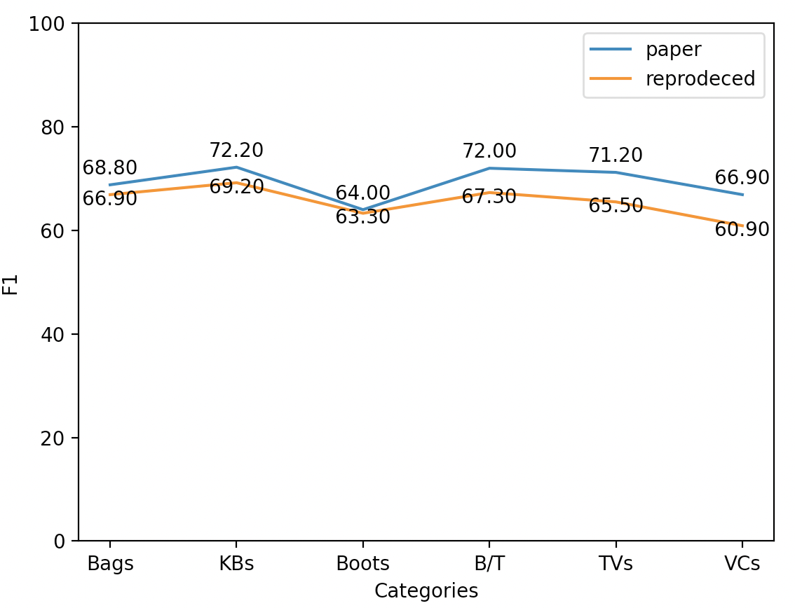
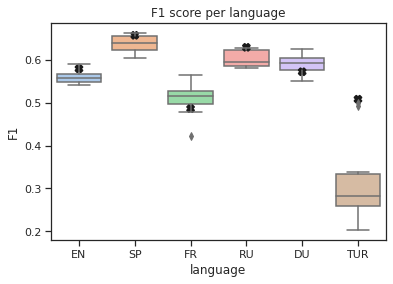
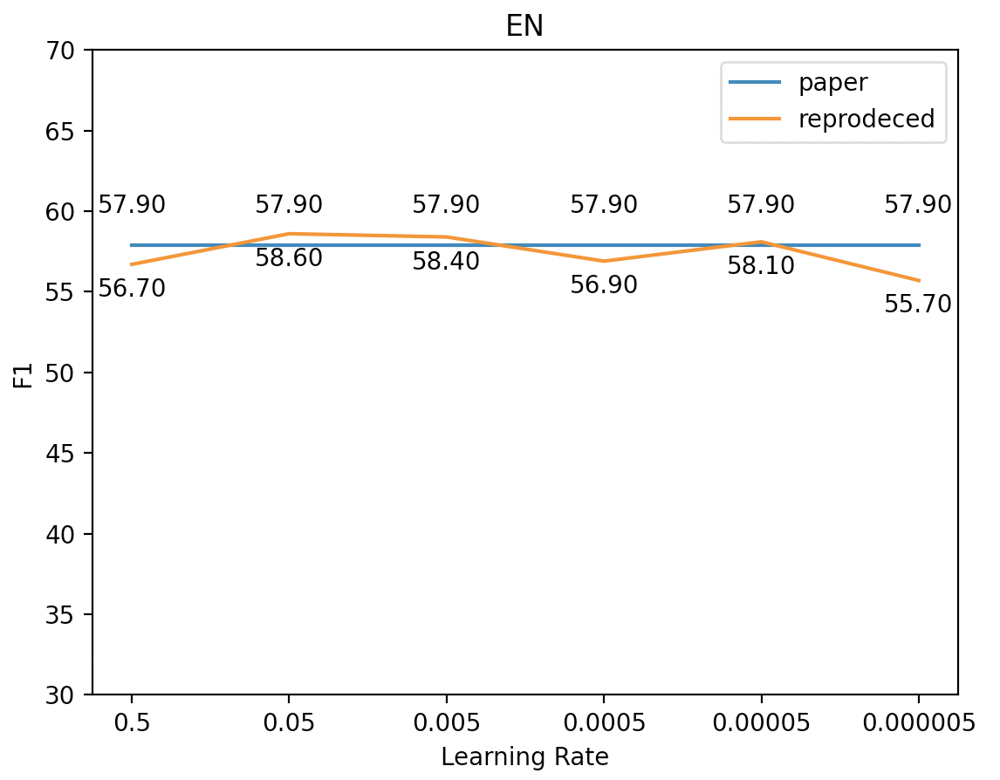
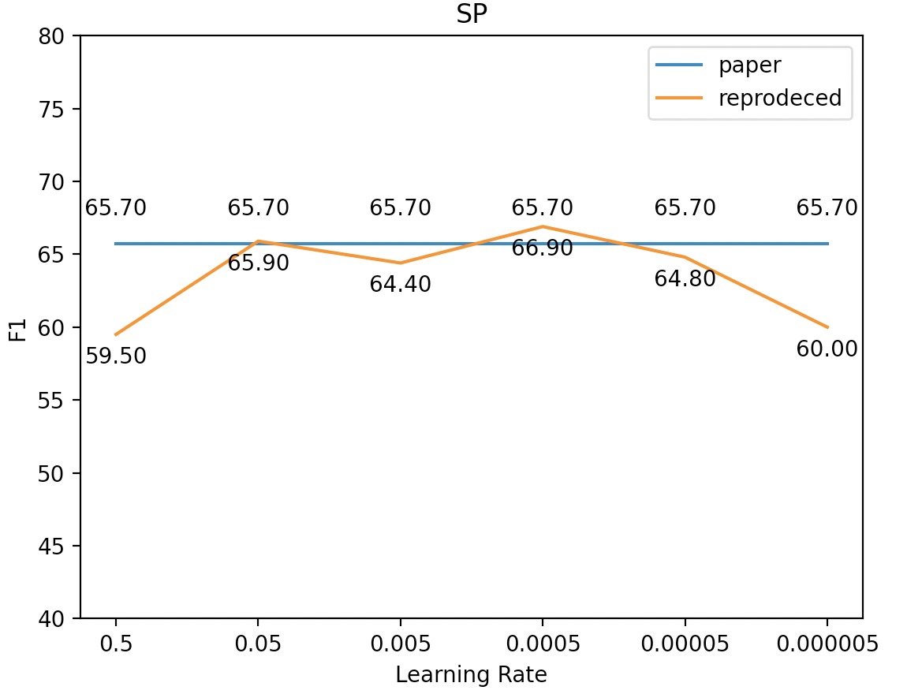
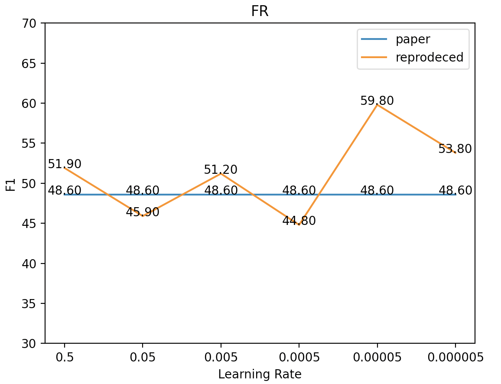
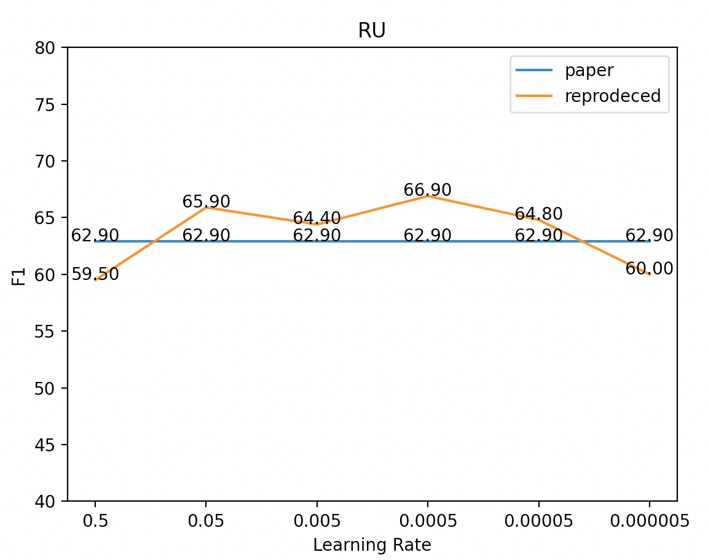
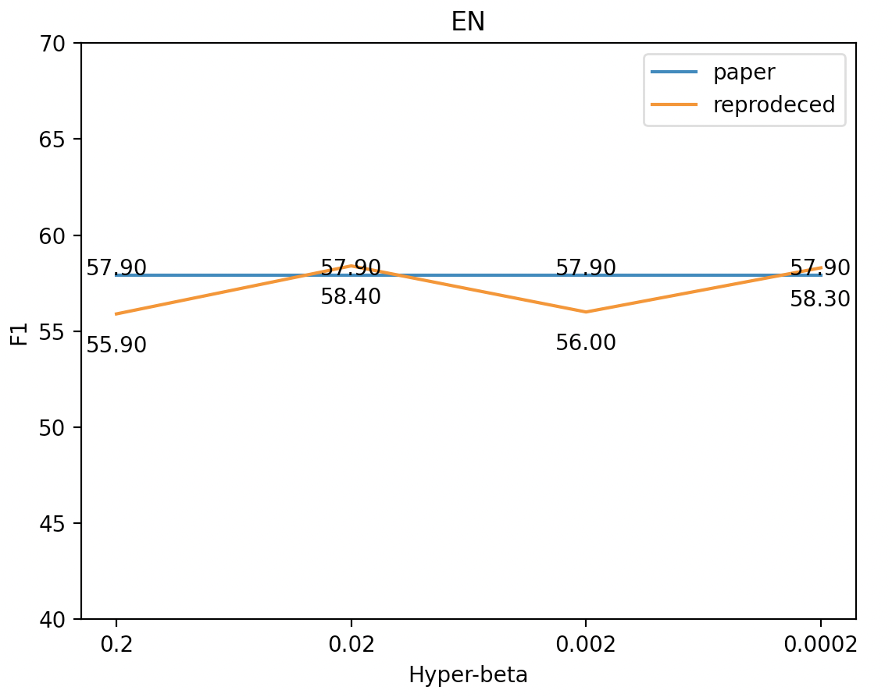
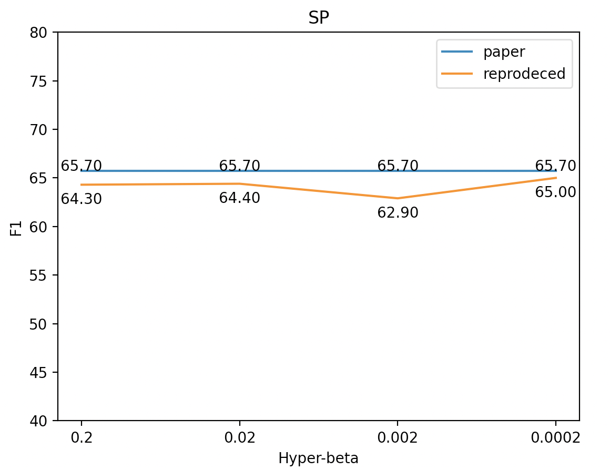
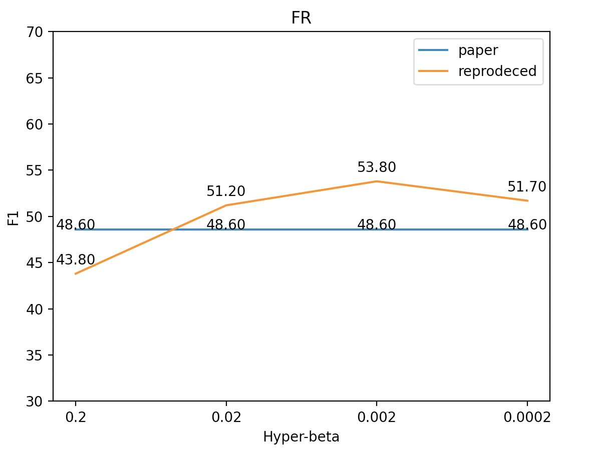
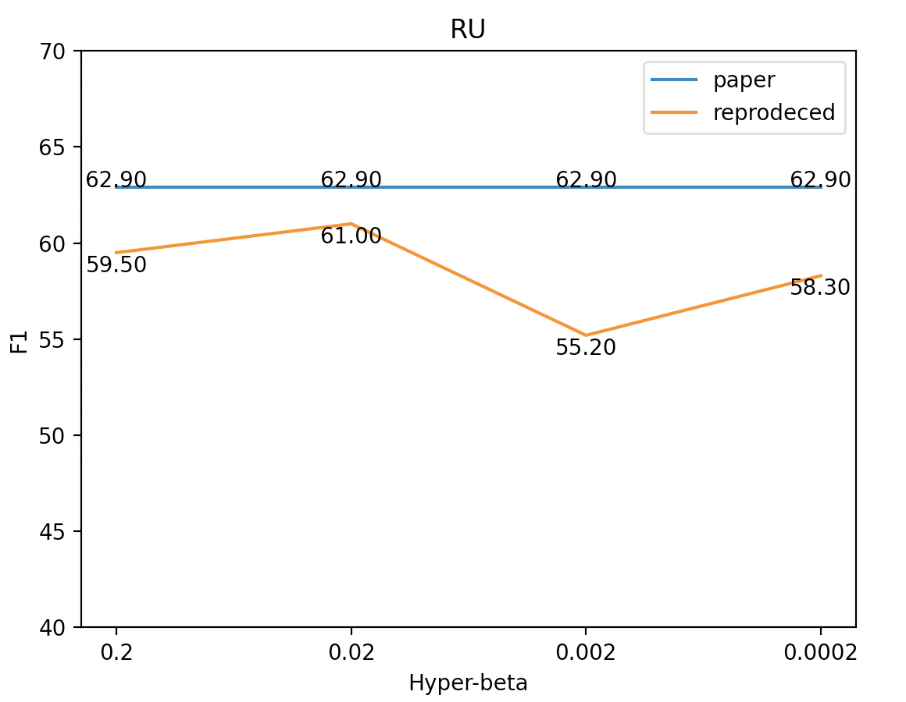

## Reproduction Blog: Hyperbolic Disentangled Representation for Fine-Grained Aspect Extraction

## Authors:
Lang Feng - 5446511,  
Haoran Wang - 5468175,  
Zhongbo Yao - 5473543,
Sasha Koryakin

## Introduction
This blog aims to describe our efforts in reproducing the paper "Hyperbolic Disentangled Representation for Fine-Grained Aspect Extraction", written by Chang-You Tai, Ming-Yao Li, and Lun-Wei Ku, 2021.

#### HDAE

## Datasets
The dataset used in our reproduce project is the resturant reviews derived from the SemEval-2016 Aspect-based Sentiment Analysis task (Pontiki et al. 2016). The original dataset covers six languages: English (En), Spanish (Sp), French (Fr), Russian (Ru), Dutch (Du), and Turkish (Tur). However, data in Turkish and Dutch is not tested in our project as a great deviation from the reported results in the original paper(Chang et al. 2021) is observed. We consider the reason to be that we are using a different computing resource(Macbook with M1 chip, without CUDA) compared with the authors. All the results in our project are derived from this modified dataset.

## Reproducibility Approach
There was no existing code originally. We were provided with a GitHub repository, https://github.com/stangelid/oposum, which is meant to preprocess the raw text files into easy-to-manipulate .hdf5 binaries. We managed to make contact with the author of the paper and got their code, which can be found here https://github.com/johnnyjana730/HDAE.   
In this reproduction, we managed to reproduce HDAE in Table 1 and Table 2 and also hyperparameters check, including lr (learning rate), hyper-beta, and gb_temp.

### Reproducing Table 1

|Categories |Bags |KBs  |Boots|B/T  |TVs  |VCs  |
|-----------|-----|-----|-----|-----|-----|-----|
|HDAE(paper)|68.8 |72.2 |64.0 |72.0 |71.2 |66.9 |
|Reproduced |66.9 |69.2 |63.3 |67.3 |65.5 |60.9 |

  
From the image above, we can see that we get similar results with the paper. However, due to the limitation of computability, our reproduced results are not as good as the paper. But we can also see that the differences are not large, which means we can get results closer to the paper given enough computability.

### Reproducing Table 2

|EN     |SP     |FR     |RU   |DU   |TUR  |
|-------|-------|-------|-----|-----|-----|
|0.543  |0.657  |0.529  |0.584|0.601|0.234|   
|0.542  |0.603  |0.509  |0.581|0.581|0.5  |    
|0.557  |0.641  |0.526  |0.627|0.592|0.339|   
|0.56   |0.663  |0.423  |0.591|0.604|0.258| 
|0.572  |0.609  |0.527  |0.626|0.574|0.266|    
|0.557  |0.638  |0.493  |0.586|0.624|0.202|    
|0.569  |0.622  |0.515  |0.585|0.61 |0.315|   
|0.545  |0.623  |0.515  |0.628|0.574|0.492|  
|0.562  |0.656  |0.479  |0.612|0.55 |0.298|  
|0.589  |0.653  |0.564  |0.598|0.595|0.258| 

We see that the majority of results from the paper fall inside the boxplot result from the reproduction, the main outlier is Turkish whose median lies far below the paper result.  

A small statistical analysis is performed to check this,
from the data we get a standart gaussian distribution with:  
mean = 0.3162  
variance = 0.0973  
x = 0.508  
Using a cdf calculation ( P(X <= x) ) we get cdf = 0.9692, which for our case become the p-value = 1-0.9692 = 0.0308, which typically is regarded as significant.

### Hyperparameters Check
We checked the sensitivity of three hyperparameters, including lr (learning rate), hyper-beta and gb_temp, and whether the author has chosen the best hyperparameters.
#### lr (Learning Rate)

We chose 6 different values for learning rate, 0.5, 0.05, 0.005, 0.0005, 0.00005, and 0.000005. After getting the results, we compare them with the result in the paper, which is the baseline of our analysis.

|lr              |EN    |SP    |FR    |RU    |
|----------------|------|------|------|------|
|lr=0.005 (paper)|57.9  |65.7  |48.6  |62.9  |
|lr=0.5          |56.7  |59.5  |51.9  |62.6  |
|lr=0.05         |58.6  |65.9  |45.9  |58.3  |
|lr=0.005        |58.4  |64.4  |51.2  |61.0  |
|lr=0.0005       |56.9  |66.9  |44.8  |58.4  |
|lr=0.00005      |58.1  |64.8  |59.8  |60.4  |
|lr=0.000005     |55.7  |60.0  |53.8  |58.1  |

|                          |                          |
:-------------------------:|:-------------------------:
|
|

From the image above, we can see that the results for different learning rates are similar to the result in the paper. However, researchers of this paper did not choose the best learning rate, especially for the FR and RU datasets. FR dataset got the best performance when the learning rate equals 0.00005 with the F1 score of 59.8. 

#### hyper-beta

|hyper-beta   |EN    |SP    |FR    |RU    |
|-------------|------|------|------|------|
|0.02 (paper) |57.9  |65.7  |48.6  |62.9  |
|0.2          |55.9  |64.3  |43.8  |59.5  |
|0.02         |58.4  |64.4  |51.2  |61.0  |
|0.002        |56.0  |62.9  |53.8  |55.2  |
|0.0002       |58.3  |65.0  |51.7  |58.3  |

|                          |                          |
:-------------------------:|:-------------------------:
|
|

The hyper parameter beta is introduce by the Poincar´e ball model, in which beta controls parameters related to the open unit ball. In order to explore whether the model is sensitive to this parameter, experiments are conducted by changing nothing but the value of beta.

The results and the corresponding values of beta are listed in the table above. It can be seen that the values of f1 fluctuates with the hyper-beta varying, which is different from the results in the original paper(Chang et al. 2021) that exactly remains the same.

According to the graph, we conclude that the hyper-beta does not affect the model directly because the value of f1 does not change monotonically as beta changes monotonically. But we do not exclude the possibilities the beta affects the model indirectly by affecting other parameters.

## Conclusion

## Contributions

## References

